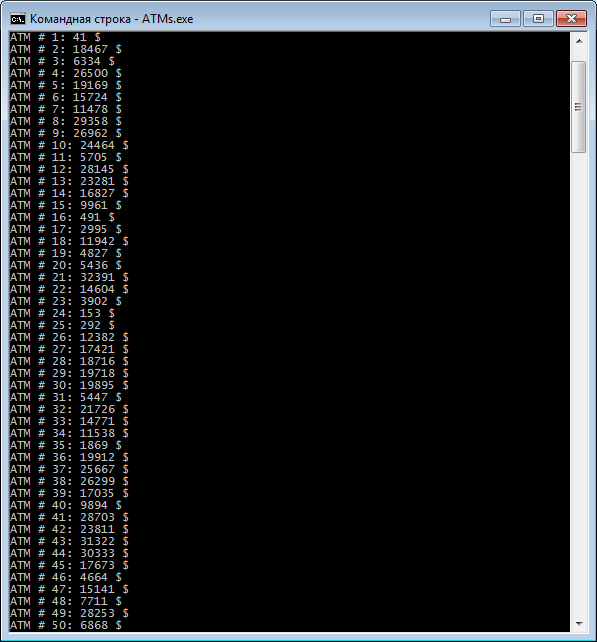
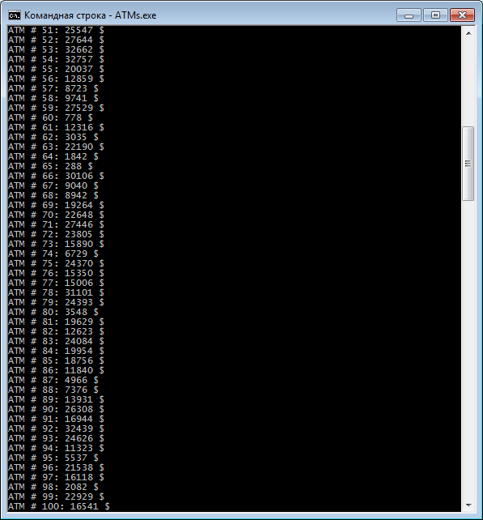

# Problem Statement

Сделать массив из 100 банкоматов и в каждом чтобы было определенное количество денег.

# Screenshots

# References

- [Генератор случайных чисел rand() в С++](http://cppstudio.com/post/339/)
