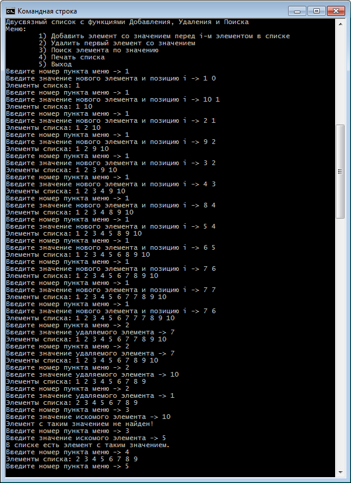

# Задание

Реализовать двусвязный список с функциями добавления, удаления и поиска.

Добавление: в качестве аргумента передается число **i**, необходимо добавить элемент до **i**-ого элемента в списке.
Если **i** больше, чем количество элементов в списке, то добавить в конец.

Удаление: передается значение элемента.
Необходимо удалить первый элемент с таким значением.

# Тестовый запуск программы

<kbd></kbd>

# Ссылки

- [Initializing member variables using the same name for constructor arguments as for the member variables allowed by the C++ standard? - Stack Overflow](https://stackoverflow.com/a/6185043/2289640)
- [Inheriting from a template class in c++ - Stack Overflow](https://stackoverflow.com/a/43736389/2289640)
- [C++ abstract class template - Stack Overflow](https://stackoverflow.com/a/9348469/2289640)
- [abstract class - cppreference.com](http://en.cppreference.com/w/cpp/language/abstract_class)
- [Why would you use an assignment in a condition? - Stack Overflow](https://stackoverflow.com/a/151870/2289640)
