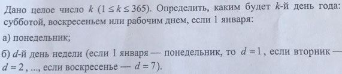
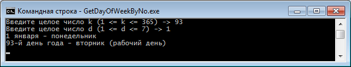
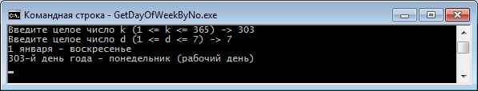

# Problem Statement

# Screenshots

## 1

2018 год начинается с понедельника.

3 апреля 2018 года, вторник - это 93 день в 2018 году.

## 2

2017 год начинается с воскресенья.

30 октября 2017 года, понедельник - это 303 день в 2017 году.

