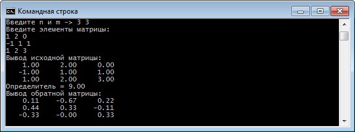
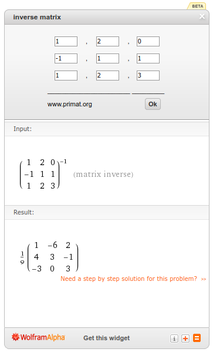

# Problem Statement

Нужно ввести и вывести n*m матрицу и найти ее обратную матрицу.

# Screenshots

# Links

- [Inverse of a square matrix](https://www.cs.rochester.edu/~brown/Crypto/assts/projects/adj.html)
- [C and C++ Program to Find Inverse of a Matrix - The Crazy Programmer](https://www.thecrazyprogrammer.com/2017/02/c-c-program-find-inverse-matrix.html)
- [Inverting matrices - Martin Thoma](https://martin-thoma.com/inverting-matrices/)
- [Wolfram|Alpha Widgets: &quot;inverse matrix&quot; - Free Mathematics Widget](http://www.wolframalpha.com/widgets/view.jsp?id=91ba4a4478a66bee9812b0804b6f9d1b)
