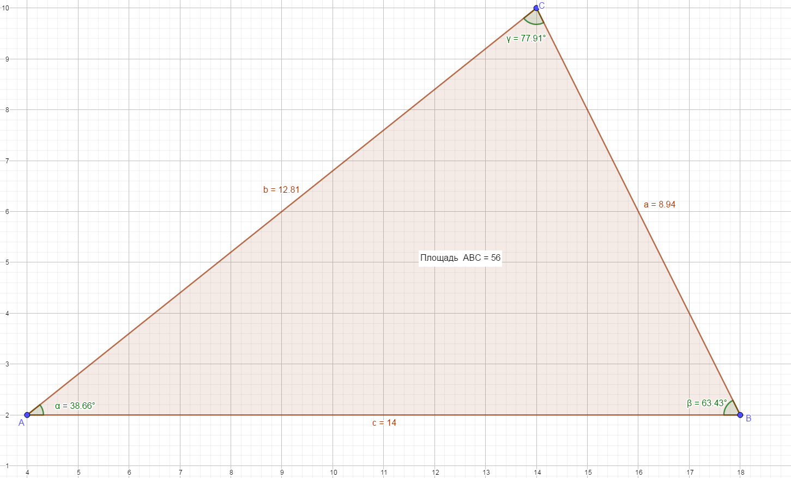

# Треугольник

<kbd></kbd>

# Ссылки

- [trigonometry - How to use the PI constant in C++ - Stack Overflow](https://stackoverflow.com/questions/1727881/how-to-use-the-pi-constant-in-c)
- [Перевод градусов в радианы и обратно](http://www.cleverstudents.ru/trigonometry/radian_and_degree_conversion.html)
